# Análise de Mortalidade por DCNT nos Municípios Brasileiros

**Disciplina:** Ciência de Dados — MPTI/IFPB — 2026.1  
**Docentes:** Damires Souza e Alex Cunha  
**Equipe:** Rodrigo de Queiroz Gonçalves Velez · Caio Jordan de Lima Maia

---

## Contexto

As Doenças Crônicas Não Transmissíveis (DCNT) — cardiovasculares, diabetes, câncer e doenças respiratórias crônicas — são responsáveis por uma parcela significativa da mortalidade no Brasil. A análise desses dados em nível municipal é fundamental para apoiar políticas públicas de saúde, permitindo identificar desigualdades regionais e orientar a distribuição de recursos.

Este projeto integra bases de dados públicas (DataSUS e IBGE) para identificar padrões e perfis municipais de mortalidade por DCNT, aplicando técnicas de ciência de dados: limpeza e integração de dados heterogêneos, análise exploratória, clustering e visualização de resultados.

## Problema de Ciência de Dados

Identificar padrões e perfis de municípios brasileiros em relação à mortalidade por DCNT, a partir da integração de diferentes bases de dados públicas. Especificamente:

- Analisar a distribuição da mortalidade por DCNT em nível municipal
- Identificar agrupamentos de municípios com características semelhantes (clustering)
- Explorar relações entre indicadores de mortalidade e variáveis demográficas

---

## Fontes de Dados

| Fonte | Descrição | Acesso | Formato bruto |
|-------|-----------|--------|---------------|
| **DataSUS / SIM** | Sistema de Informações sobre Mortalidade — declarações de óbito com causas por CID-10, por município, estado e ano | FTP `ftp.datasus.gov.br` | DBC |
| **DataSUS / CID-10 v2008** | Tabelas de referência CID-10: capítulos, grupos, categorias e subcategorias | HTTP `www2.datasus.gov.br` | ZIP/CSV |
| **DataSUS / CID-10 FTP** | Tabelas de referência CID-10 em DBF | FTP `ftp.datasus.gov.br` | DBF |
| **IBGE / POPSVS** | Projeções populacionais por município via FTP do DataSUS | FTP `ftp.datasus.gov.br` | ZIP/DBF |
| **IBGE API REST** | Cadastro oficial de municípios com código IBGE, microrregião, mesorregião e UF | API `servicodados.ibge.gov.br` | JSON |
| **IBGE Shapefile** | Malha municipal vetorial 2022 para geração de mapas coropléticos | HTTP `geoftp.ibge.gov.br` | ZIP/SHP |

Todos os dados são secundários, já agregados e anonimizados pelos órgãos responsáveis — o projeto está em conformidade com a LGPD.

---

## Arquitetura Medallion

O pipeline segue a arquitetura Medallion com três camadas, implementado integralmente no notebook [`projeto_cd_2026_01.ipynb`](projeto_cd_2026_01.ipynb):

```
🥉 Bronze  →  🥈 Prata  →  🥇 Ouro
(coleta)      (limpeza)    (análise)
```

| Camada | Pasta de dados | Descrição |
|--------|----------------|-----------|
| **Bronze** | `dados/1-bronze/` | Dados brutos coletados das fontes, convertidos para Parquet sem transformação de conteúdo |
| **Prata** | `dados/2-prata/` | Dados limpos, padronizados e filtrados por fonte |
| **Ouro** | `dados/3-ouro/` | Dataset analítico enriquecido com joins entre todas as fontes, análises e artefatos visuais |

> A pasta `dados/` é gerada localmente pela execução do notebook e **não é versionada no repositório**.

---

## Pipeline de Execução

Todo o pipeline é executado no notebook [`projeto_cd_2026_01.ipynb`](projeto_cd_2026_01.ipynb). Execute as células em ordem.

### Pré-requisitos

```bash
pip install pandas pyarrow pyreaddbc dbfread matplotlib seaborn scikit-learn scipy geopandas
```

---

## Camada Bronze — Coleta e Conversão

### Bronze 1/4 — DataSUS SIM (Declarações de Óbito)

Acessa o FTP `ftp.datasus.gov.br` no diretório `/dissemin/publicos/SIM/CID10/DORES/` e baixa um arquivo DBC por estado por ano no formato `DO{UF}{ANO}.dbc`. Cada DBC é convertido para Parquet via `pyreaddbc` + `dbfread`. O DBC é excluído após conversão bem-sucedida.

- **Período:** 2010–2024 (15 exercícios)
- **Estados:** 27 UFs
- **Saída:** `dados/1-bronze/SIM/parquet/{ANO}/DO{UF}{ANO}.parquet`

### Bronze 2/4 — IBGE Municípios (API REST)

Consulta a API REST do IBGE e baixa o cadastro completo de 5.570 municípios com código IBGE, nome, UF e região.

- **Saída:** `dados/1-bronze/ibge_dados_municipios/parquet/municipios.parquet`

### Bronze 3/4 — IBGE Projeções Populacionais

Baixa do FTP do DataSUS os arquivos ZIP de projeções populacionais, extrai os DBFs e converte para Parquet.

- **Período:** 2010–2024 (15 exercícios)
- **Saída:** `dados/1-bronze/ibge_populacao/parquet/{ANO}/POP{AA}.parquet`

### Bronze 4/4 — CID-10 (tabelas de referência)

Baixa as tabelas de referência CID-10 de duas fontes independentes:

| Fonte | Acesso | Saída |
|-------|--------|-------|
| `v2008` | HTTP `www2.datasus.gov.br` | `dados/1-bronze/cid_10_datasus_v2008/parquet/` |
| `ftp` | FTP `ftp.datasus.gov.br` | `dados/1-bronze/cid_10_datasus_ftp/parquet/` |

**Estrutura Bronze gerada:**

```
dados/1-bronze/
├── SIM/
│   └── parquet/
│       ├── 2010/  DO{UF}2010.parquet  (até 27 arquivos)
│       ├── ···
│       └── 2024/  DO{UF}2024.parquet
├── ibge_dados_municipios/
│   └── parquet/municipios.parquet
├── ibge_populacao/
│   └── parquet/
│       ├── 2010/  POP10.parquet
│       ├── ···
│       └── 2024/  POP24.parquet
├── cid_10_datasus_v2008/
│   └── parquet/  (CID-10-CAPITULOS, GRUPOS, CATEGORIAS, SUBCATEGORIAS, CID-O-*)
└── cid_10_datasus_ftp/
    └── parquet/  (CID10.parquet, CIDCAP10.parquet)
```

---

## Camada Prata — Limpeza, Normalização e Filtros

### Prata 1/4 — CID-10

Consolida as tabelas CID-10 do Bronze em um único dataset normalizado com hierarquia completa.

- **Ajustes:** remoção de prefixos numéricos das descrições, derivação de capítulo e grupo por intervalo de código
- **Schema:** `codigo_capitulo`, `descricao_capitulo`, `codigo_grupo`, `descricao_grupo`, `codigo_categoria`, `descricao_categoria`, `codigo_cid10`, `descricao_cid10`
- **Saída:** `dados/2-prata/CID10/cid10.parquet` + `.csv`

### Prata 2/4 — IBGE Municípios

Normaliza o cadastro de municípios e gera o código IBGE de 6 dígitos (`codigo_municipio_6c`) necessário para o join com o SIM.

- **Ajustes:** conversão de tipos, strip de espaços, extração de `codigo_municipio_6c = codigo_municipio[:6]`
- **Schema:** `codigo_municipio` (7c), `codigo_municipio_6c`, `nome_municipio`, `codigo_estado`, `sigla_estado`, `nome_estado`, `codigo_regiao`, `sigla_regiao`, `nome_regiao`
- **Saída:** `dados/2-prata/IBGE/ibge_municipios.parquet` + `.csv`

### Prata 3/4 — IBGE Projeções Populacionais

Agrega população por município, exercício e sexo (soma todas as faixas etárias de cada arquivo anual).

- **Mapeamento de sexo:** `1→M`, `2→F`, `0/9→I`
- **Schema:** `codigo_municipio`, `exercicio`, `sexo` (M/F/I), `populacao`
- **Ordenação:** `exercicio → codigo_municipio → sexo`
- **Saída:** `dados/2-prata/IBGE/ibge_populacao.parquet` + `.csv`

### Prata 4/4 — DataSUS SIM (Declarações de Óbito)

Agrega óbitos por município, causa básica (CID-10), sexo e exercício. Classifica cada grupo como DCNT ou não. Gera um arquivo por exercício, consolidando todos os estados.

**Filtros aplicados (registros removidos, em ordem):**

| # | Filtro | Campo | Critério |
|---|--------|-------|----------|
| 1 | Apenas óbitos não-fetais | `TIPOBITO` | ≠ `2` |
| 2 | Município de ocorrência preenchido | `CODMUNOCOR` | vazio ou `nan` |
| 3 | Causa básica preenchida | `CAUSABAS` | vazio ou `nan` |
| 4 | Município válido no IBGE | `CODMUNOCOR` | código não existe na tabela de municípios Prata |

**Critério de classificação DCNT (`dcnt = 'S'`):**

| Faixa CID-10 | Grupo |
|---|---|
| I00–I99 | Doenças cardiovasculares |
| C00–C97 | Neoplasias malignas |
| J30–J98 (exceto J36) | Doenças respiratórias crônicas |
| E10–E14 | Diabetes mellitus |

- **Schema:** `sexo`, `codigo_municipio`, `cid10`, `exercicio`, `dcnt`, `arquivo_origem`, `obitos`
- **Saída:** `dados/2-prata/SIM/{ANO}/datasus_sim_{ANO}.parquet` + `.csv`

---

## Camada Ouro — Integração e Dataset Analítico

### Ouro 1/2 — SIM × Municípios × CID-10

Para cada exercício, realiza joins entre os três datasets prata, enriquece com hierarquia geográfica e classificação CID-10.

**Joins realizados:**

| Join | Chave esquerda | Chave direita |
|------|---------------|---------------|
| SIM × Municípios | `sim.codigo_municipio` | `mun.codigo_municipio_6c` |
| resultado × CID-10 | `sim.cid10` | `cid.codigo_cid10` |

- **Ordenação:** `codigo_municipio → codigo_cid10 → sexo`
- **Saída:** `dados/3-ouro/SIM/{ANO}/sim_ouro_{ANO}.parquet` + `.csv`

### Ouro 2/2 — Populacao × Municípios

Enriquece a população Prata com hierarquia geográfica completa.

- **Saída:** `dados/3-ouro/IBGE/populacao_municipio.parquet` + `.csv`

### Atributo Derivado — Taxa de Mortalidade DCNT por 100 mil habitantes

**Fórmula:** `taxa_dcnt_100k = (obitos_dcnt / populacao) × 100.000`

| # | Coluna | Tipo | Descrição |
|---|--------|------|-----------|
| 1 | `exercicio` | int | Ano |
| 2 | `codigo_municipio` | string | Código IBGE 6 dígitos |
| 3 | `nome_municipio` | string | Nome do município |
| 4 | `sigla_estado` | string | Sigla da UF |
| 5 | `nome_estado` | string | Nome da UF |
| 6 | `sigla_regiao` | string | Sigla da região |
| 7 | `nome_regiao` | string | Nome da região |
| 8 | `obitos_dcnt` | int | Total de óbitos por DCNT |
| 9 | `populacao` | int | População total do município no exercício |
| 10 | `taxa_dcnt_100k` | float | Taxa de mortalidade DCNT por 100 mil habitantes |

- **Saída:** `dados/3-ouro/SIM/taxa_dcnt_municipio.parquet` + `.csv`

---

## Semana 4 — Análise Exploratória, Clustering e Visualizações

Toda a análise da Semana 4 opera sobre o dataset `taxa_dcnt_municipio.parquet` gerado na camada Ouro e sobre os arquivos `sim_ouro_{ANO}.parquet` para composição por grupo de DCNT.

### Análise Exploratória de Dados (EDA)

#### Célula 4.1 — Carregamento e Visão Geral

Carrega o dataset Ouro e exibe estatísticas descritivas globais.

- **Shape:** ~82 mil linhas × 10 colunas (municípios × exercícios)
- **Saídas no console:** distribuição da taxa por percentis (p10, p25, p50, p75, p90, p99), taxa média por grande região

#### Célula 4.2 — Distribuições

Histograma da distribuição geral da taxa DCNT e boxplots comparativos por grande região, ordenados pela mediana.

- **Saída:** `dados/3-ouro/eda_distribuicao.png`

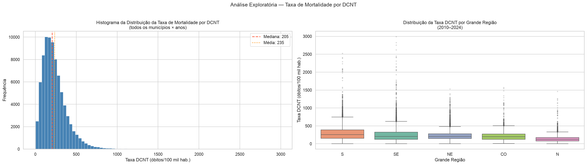

#### Célula 4.2b — Ranking Municipal (Top/Bottom 10)

Identifica os 10 municípios com maior e os 10 com menor taxa média de DCNT (média histórica 2010–2024), exibidos como gráfico de barras horizontais lado a lado.

- **Saída:** `dados/3-ouro/eda_ranking_municipios.png`

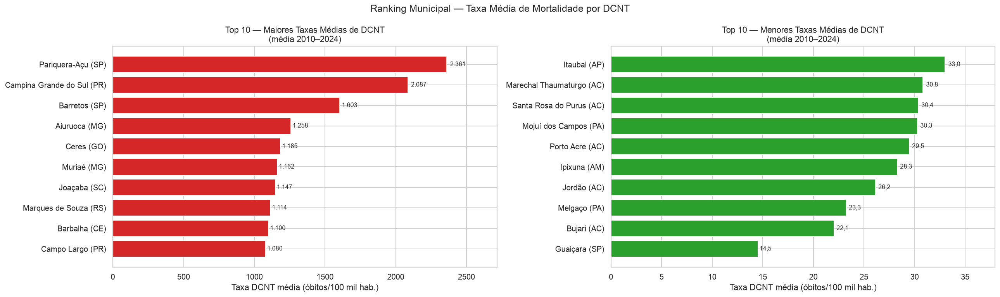

> **Nota interpretativa:** municípios com baixo volume populacional podem apresentar taxas instáveis por flutuação estatística.

#### Célula 4.3 — Evolução Temporal por Região

Série histórica da taxa média de DCNT por grande região (2010–2024) e média nacional, com destaque visual para o período COVID-19 (2020–2021).

- **Saída:** `dados/3-ouro/eda_temporal.png`

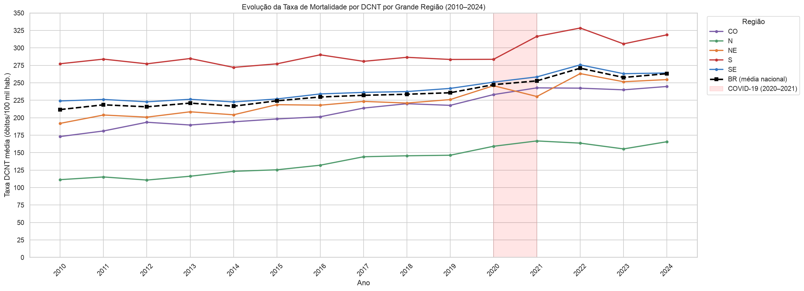

#### Célula 4.4 — Breakdown por Grupo de DCNT

Proporção de óbitos por grupo de DCNT (Cardiovascular, Neoplasia, Respiratória, Diabetes) em cada grande região, acumulados em gráfico de barras empilhadas.

- **Saída:** `dados/3-ouro/eda_breakdown_dcnt.png`

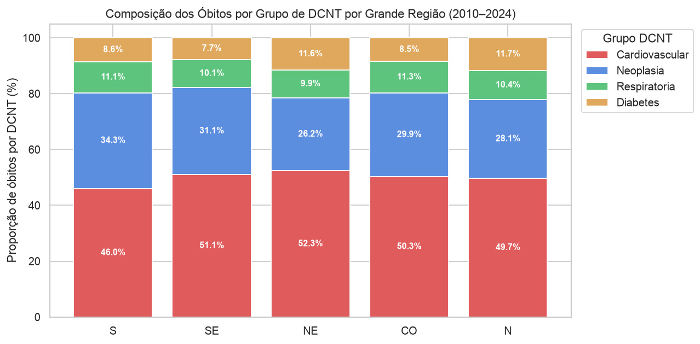

#### Célula 4.6 — Correlações entre Indicadores Municipais

Matriz de correlação (Pearson e Spearman) entre os indicadores que alimentam o clustering — taxa média, tendência temporal, porte populacional (log) e proporções por grupo de DCNT. Além de cumprir a etapa de **correlações** da análise exploratória, o heatmap diagnostica a **redundância composicional** das quatro proporções (que somam ≈1): a mais colinear (**`prop_cardiovascular`**, |correlação| média 0,46 com as demais) é removida do conjunto de features na etapa de modelagem.

- **Saída:** `dados/3-ouro/eda_correlacao.png`

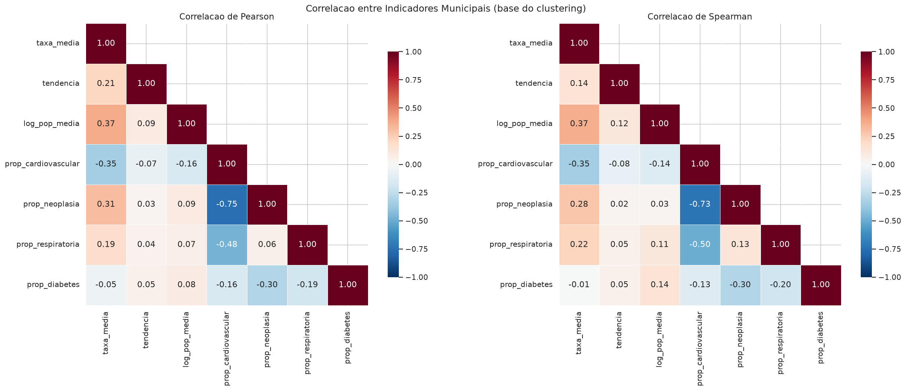

---

### Clustering — Identificação de Perfis Municipais

#### Célula 5.1 — Feature Matrix

Constrói uma linha por município com features derivadas do histórico completo 2010–2024:

| Feature | Descrição |
|---------|-----------|
| `taxa_media` | Média histórica da taxa DCNT/100k hab. |
| `tendencia` | Slope da regressão linear da taxa sobre o tempo (via `scipy.stats.linregress`) |
| `log_pop_media` | Log₁₀ da população média — comprime a escala de porte municipal |
| `prop_cardiovascular` | Proporção dos óbitos DCNT por doenças cardiovasculares |
| `prop_neoplasia` | Proporção dos óbitos DCNT por neoplasias |
| `prop_respiratoria` | Proporção dos óbitos DCNT por doenças respiratórias |
| `prop_diabetes` | Proporção dos óbitos DCNT por diabetes |

Municípios com menos de 3 exercícios de dados têm `tendencia = NaN`, imputado pela mediana na célula seguinte. Das 7 features, o clustering usa **6**: `prop_cardiovascular` é descartada na 5.2 por redundância composicional (ver Célula 4.6).

#### Célula 5.2 — Normalização e Determinação do k

Pré-processa as features e encontra o número ótimo de clusters usando dois critérios complementares:

- **Filtro de estabilidade:** municípios de porte muito pequeno têm taxas voláteis (denominador populacional baixo). Aplica-se `log_pop_media ≥ 4,0` (~10 mil hab.), reduzindo de **5.570 → 3.103 municípios** (2.467 removidos). Os excluídos ficam sem rótulo e aparecem em cinza no mapa.
- **Redução de features:** remove `prop_cardiovascular` (a proporção mais colinear, diagnosticada na 4.6), deixando **6 features** — evita a redundância das proporções composicionais.
- **Imputação:** `SimpleImputer(strategy='median')` para os raros NaN
- **Normalização:** `RobustScaler` (usa mediana e IQR — robusto a outliers, adequado para dados municipais heterogêneos)
- **Elbow Method:** plota a inércia do K-Means para k de 2 a 10; o cotovelo é detectado automaticamente pela 2ª derivada da inércia
- **Silhouette Score:** calculado para cada k com amostragem de 5.000 pontos; o k com maior score é adotado como `best_k`
- **Convergência:** o notebook imprime explicitamente se os dois critérios convergem para o mesmo k ou divergem. Na execução atual, os critérios **divergem**: o cotovelo (2ª derivada da inércia) aponta k = 3, enquanto o Silhouette é máximo em k = 2 (0,2523) e cai para ≤ 0,164 a partir de k = 3. A equipe adota o Silhouette como critério principal, por medir diretamente separação e coesão dos grupos.

- **Saída:** `dados/3-ouro/clustering_elbow.png`

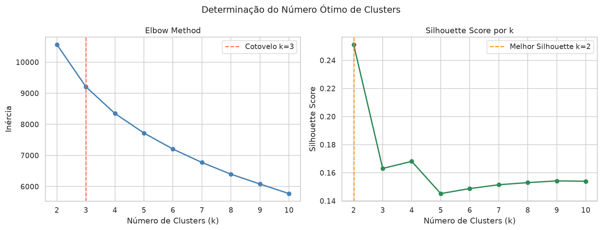

#### Célula 5.3 — K-Means Final e Análise dos Clusters

Aplica o K-Means com `K_FINAL = best_k` e analisa os perfis resultantes:

1. **Silhouette Score pós-treinamento** — valida a qualidade do modelo final
2. **Perfil por cluster** — média de cada feature por cluster (interpretação semântica)
3. **Distribuição geográfica** — tabela cruzada cluster × grande região
4. **PCA 2D** — projeção das features em 2 dimensões para visualização dos grupos

- **Saída:** `dados/3-ouro/clustering_pca.png`
- **Saída:** `dados/3-ouro/municipios_clusters.parquet` + `.csv` ← dataset final com rótulo de cluster por município

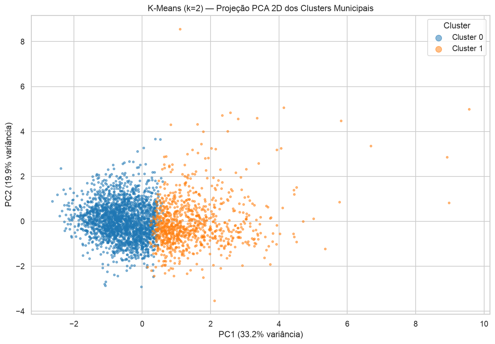

**Resultado (k = 2, Silhouette = 0,2523, 53,1% da variância nos 2 PCs):** entre k de 2 a 10, o Silhouette favorece k = 2 de forma clara (0,2523 contra ≤ 0,164 para k ≥ 3). O agrupamento divide os 3.103 municípios estáveis em dois perfis ao longo do **gradiente dominante** de mortalidade:

| Cluster | Municípios | Predomínio regional | Perfil |
|---------|-----------|---------------------|--------|
| **0** | 2.193 (60% N/NE) | Norte / Nordeste | Municípios menores (log₁₀pop médio 4,32, ≈ 21 mil hab.), taxa DCNT mais baixa (202,1/100k), maior peso relativo de **diabetes** (0,123 vs. 0,092) |
| **1** | 910 (75% S/SE) | Sul / Sudeste | Municípios maiores (log₁₀pop médio 4,76, ≈ 58 mil hab.), taxa DCNT alta (420,4/100k), tendência de alta mais forte (slope 6,43 vs. 4,10), perfil de **neoplasia/respiratória** |

A separação reflete o gradiente de **transição demográfica e epidemiológica** entre as regiões. O filtro de estabilidade e a remoção da proporção redundante elevaram o Silhouette frente à versão sem filtro (todos os 5.570 municípios, sem exclusão dos de baixo porte).

> **Limitação:** um Silhouette de 0,25 indica **estrutura fraca** — a projeção PCA mostra que os municípios formam um *continuum* cortado em dois, e não grupos naturalmente separados. O agrupamento deve ser lido como uma **partição exploratória do gradiente dominante**, não como classes discretas. A Célula 5.4 testa formalmente outros algoritmos para confirmar essa escolha.

#### Célula 5.4 — Avaliação de Modelos Alternativos

Para validar a escolha do K-Means, três paradigmas alternativos são ajustados sobre a mesma matriz de features e comparados por **três métricas internas** (Silhouette ↑, Davies-Bouldin ↓, Calinski-Harabasz ↑). O melhor modelo de partição limpa é **adotado como final** e alimenta o mapa e o perfil.

| Modelo | k | Silhouette | Davies-Bouldin | Calinski-Harabasz |
|--------|---|-----------|----------------|-------------------|
| **K-Means** | 2 | **0,252** | **1,74** | **800,1** |
| Aglomerativo (Ward) | 2 | 0,188 | 2,10 | 593,9 |
| GMM | 5 | 0,099 | 2,13 | 403,3 |
| DBSCAN | 1 | n/a | — | ruído 4,2% (eps=1,18) |

**Conclusão:** o **K-Means (k=2) vence nas três métricas**. Mais revelador: o **DBSCAN não encontra agrupamento por densidade** (colapsa em 1 cluster) e o **GMM** se dispersa em componentes sobrepostos (Silhouette 0,08) — evidência forte de que os municípios formam um **gradiente contínuo**, não grupos discretos. O dendrograma (Ward) confirma: o maior salto de distância ocorre no corte em 2 grupos. A escolha do K-Means k=2 fica, assim, rigorosamente justificada.

- **Saídas:** `dados/3-ouro/clustering_comparacao.png`, `dados/3-ouro/clustering_dendrograma.png`

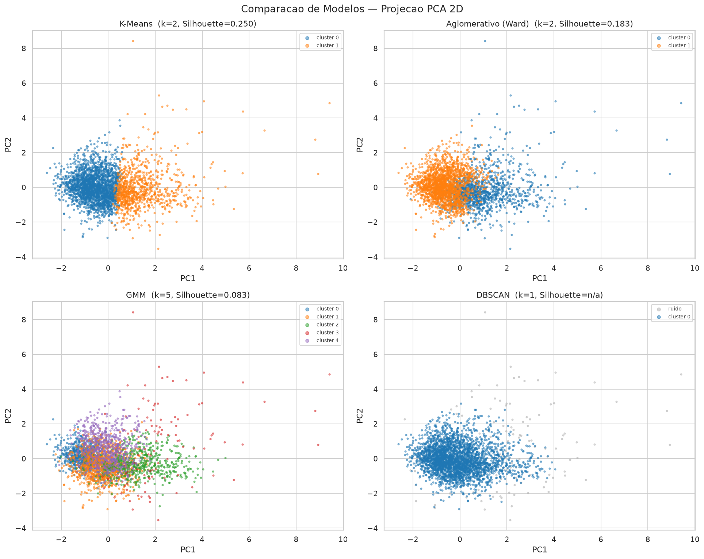

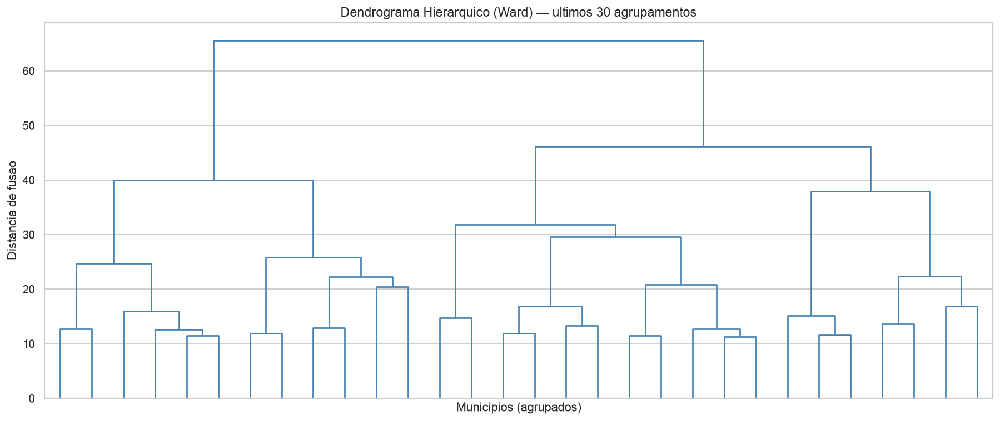

---

### Visualizações Finais

#### Célula 6.1 — Mapa Coroplético

Baixa o shapefile de municípios do IBGE 2022 e gera dois mapas lado a lado:

| Mapa | Dado | Escala |
|------|------|--------|
| Esquerdo | Taxa DCNT/100k hab. em 2024 | Contínua `YlOrRd` |
| Direito | Cluster atribuído (K-Means) | Discreta `tab10`, mesma paleta da célula 5.3 |

Municípios sem dados suficientes para clustering aparecem em cinza claro. A legenda do mapa de clusters é construída manualmente para garantir correspondência exata de cores com o gráfico PCA da célula 5.3.

- **Shapefile:** `dados/shapefiles/BR_Municipios_2022.shp` (baixado automaticamente se ausente)
- **Saída:** `dados/3-ouro/mapa_dcnt_clusters.png`

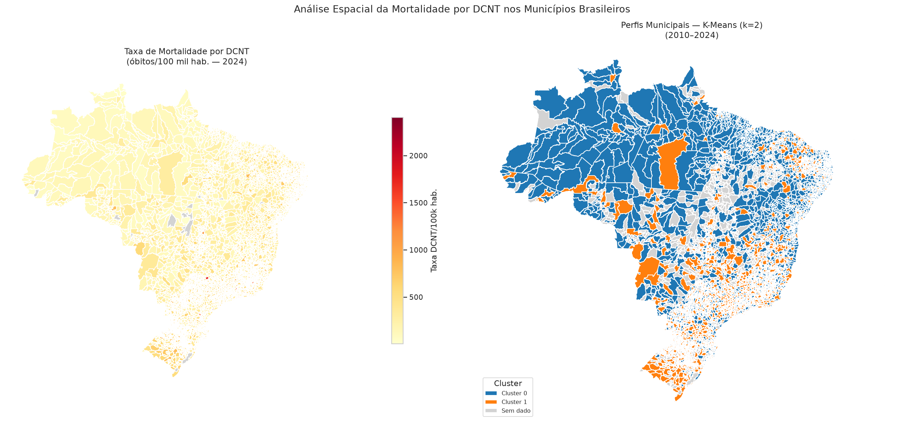

#### Célula 6.2 — Perfil Comparativo dos Clusters

Gráfico de barras agrupadas que compara os clusters nas 6 features usadas no modelo. Cada barra mostra o valor do cluster como **percentual do cluster líder** naquela dimensão (o maior sempre aparece em 100%), garantindo que todos os clusters sejam visíveis mesmo quando as diferenças absolutas são grandes. O percentual é anotado sobre cada barra.

- **Saída:** `dados/3-ouro/clustering_perfil.png`

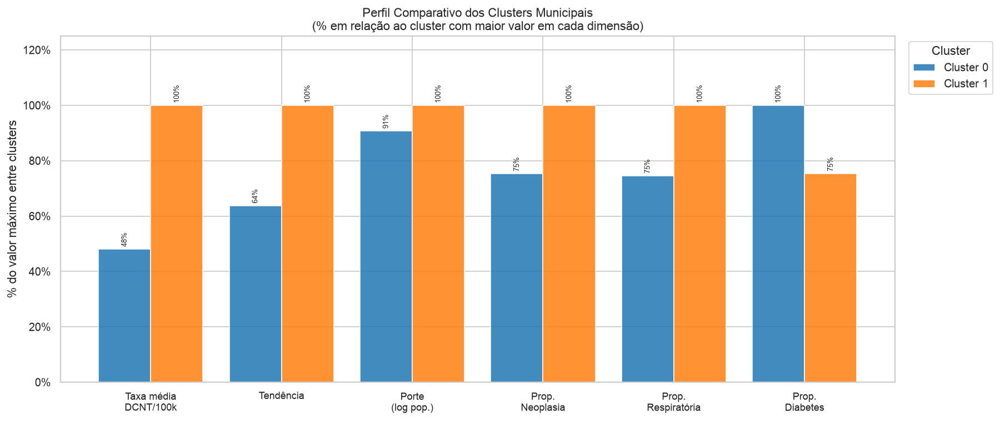

---

## Dicionário de Dados — Dataset Ouro (`sim_ouro_{ANO}`)

Granularidade: **uma linha por combinação de** município × CID-10 × sexo × arquivo de origem.

| # | Coluna | Tipo | Origem | Descrição |
|---|--------|------|--------|-----------|
| 1 | `sexo` | string | SIM | Sexo do falecido: `M` · `F` · `I` (ignorado) |
| 2 | `codigo_municipio` | string | SIM | Código IBGE 6 dígitos do município de ocorrência |
| 3 | `codigo_municipio_6c` | string | Municípios | Código IBGE 6 dígitos validado |
| 4 | `nome_municipio` | string | Municípios | Nome oficial do município |
| 5 | `sigla_estado` | string | Municípios | Sigla da UF |
| 6 | `nome_estado` | string | Municípios | Nome completo da UF |
| 7 | `sigla_regiao` | string | Municípios | Sigla da grande região |
| 8 | `nome_regiao` | string | Municípios | Nome da grande região |
| 9 | `codigo_cid10` | string | CID-10 | Código da causa básica do óbito |
| 10 | `descricao_cid10` | string | CID-10 | Descrição da causa básica |
| 11 | `exercicio` | string | SIM | Ano de ocorrência do óbito |
| 12 | `dcnt` | string | Calculado | `S` = causa DCNT · `N` = demais causas |
| 13 | `arquivo_origem` | string | SIM | Arquivo bronze de origem (ex.: `DOSP2010`) |
| 14 | `obitos` | int | SIM | Contagem de óbitos agregada por grupo |

---

## Dicionário de Dados — Dataset de Clusters (`municipios_clusters`)

Granularidade: **uma linha por município** (média histórica 2010–2024).

| # | Coluna | Tipo | Descrição |
|---|--------|------|-----------|
| 1 | `codigo_municipio` | string | Código IBGE 6 dígitos |
| 2 | `nome_municipio` | string | Nome do município |
| 3 | `sigla_estado` | string | Sigla da UF |
| 4 | `sigla_regiao` | string | Sigla da grande região |
| 5 | `taxa_media` | float | Taxa DCNT média histórica (óbitos/100k hab.) |
| 6 | `tendencia` | float | Slope anual da taxa (regressão linear 2010–2024) |
| 7 | `log_pop_media` | float | Log₁₀ da população média |
| 8 | `prop_cardiovascular` | float | Proporção de óbitos DCNT por cardiovascular |
| 9 | `prop_neoplasia` | float | Proporção de óbitos DCNT por neoplasia |
| 10 | `prop_respiratoria` | float | Proporção de óbitos DCNT por respiratória |
| 11 | `prop_diabetes` | float | Proporção de óbitos DCNT por diabetes |
| 12 | `cluster` | int | Rótulo do cluster K-Means (0 a K_FINAL−1) |

---

## Estrutura do Repositório

```
.
├── projeto_cd_2026_01.ipynb          # Notebook principal — executa todo o pipeline
├── documentos/
│   ├── Relatorio CD - Mortes por DCNT v2.docx    # Relatório final (versão enxuta, entregável)
│   ├── Relatorio CD - Mortes por DCNT.docx       # Relatório completo/didático (referência)
│   ├── Apresentacao_DCNT_IFPB.pptx               # Slides da apresentação (~7 min)
│   └── projeto/
│       ├── Contexto_Projeto_Ciencia_de_Dados.pdf
│       ├── Cronograma_Projeto_Ciencia_de_Dados.pdf
│       └── Roteiro do projeto de Ciência de Dados.pdf
├── docs/
│   └── imagens/
│       └── semana4/                  # Artefatos visuais versionados (Semana 4)
│           ├── eda_distribuicao.png
│           ├── eda_ranking_municipios.png
│           ├── eda_temporal.png
│           ├── eda_breakdown_dcnt.png
│           ├── eda_correlacao.png
│           ├── clustering_elbow.png
│           ├── clustering_pca.png
│           ├── clustering_comparacao.png
│           ├── clustering_dendrograma.png
│           ├── clustering_perfil.png
│           └── mapa_dcnt_clusters.png
└── dados/                            # Gerado localmente — NÃO versionado
    ├── 1-bronze/
    ├── 2-prata/
    ├── 3-ouro/
    │   ├── SIM/
    │   │   ├── {ANO}/  sim_ouro_{ANO}.parquet + .csv
    │   │   └── taxa_dcnt_municipio.parquet + .csv
    │   ├── IBGE/
    │   │   └── populacao_municipio.parquet + .csv
    │   ├── municipios_clusters.parquet + .csv   ← Semana 4
    │   ├── eda_distribuicao.png                 ← Semana 4
    │   ├── eda_ranking_municipios.png           ← Semana 4
    │   ├── eda_temporal.png                     ← Semana 4
    │   ├── eda_breakdown_dcnt.png               ← Semana 4
    │   ├── eda_correlacao.png                   ← Semana 4
    │   ├── clustering_elbow.png                 ← Semana 4
    │   ├── clustering_pca.png                   ← Semana 4
    │   ├── clustering_comparacao.png            ← Semana 4
    │   ├── clustering_dendrograma.png           ← Semana 4
    │   ├── clustering_perfil.png                ← Semana 4
    │   └── mapa_dcnt_clusters.png               ← Semana 4
    └── shapefiles/
        └── BR_Municipios_2022.shp (+ arquivos auxiliares)  ← Semana 4
```

---

## Cronograma

| Semana | Período | Etapa | Marco | Status |
|--------|---------|-------|-------|--------|
| 1 | 02/06–08/06 | Seleção e coleta das fontes | Repositório + coleta Bronze implementada | ✅ |
| 2–3 | 09/06–22/06 | Preparação, integração e consolidação | Prata + Ouro + dicionário de dados | ✅ |
| 4 | 23/06–29/06 | Análise e modelagem | EDA, clustering e visualizações | ✅ |
| 5 | 30/06–06/07 | Redação e fechamento | Relatório final (`Relatorio CD - Mortes por DCNT v2.docx`, 12 páginas) + notebook reproduzível | ✅ |
| 6 | 07/07–14/07 | Apresentação | Slides prontos (`Apresentacao_DCNT_IFPB.pptx`, ~7 min) — apresentação oral ainda não realizada | ✅ |

**Marcos-chave:**

| Data | Marco | Status |
|------|-------|--------|
| 22/06/2026 | Dados limpos e prontos para integração | ✅ |
| 22/06/2026 | Dataset final consolidado e dicionário fechado | ✅ |
| 29/06/2026 | Análises, clustering e visualizações concluídas | ✅ |
| 06/07/2026 | Entrega do relatório final, notebook e artefatos | ✅ |
| 07/07 ou 14/07/2026 | Apresentação do projeto | ✅ |
